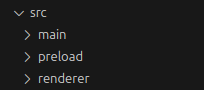

# ELECTRON + VITE CONVENTIONS  

An Electron project can become quite complex over time, especially when integrating external APIs or services that require various operations. For this reason, it's essential to logically structure your project from the beginning and make it as modular as possible. Below are some conventions I’ve developed over the years while working on increasingly larger Electron projects.

Electron divides the project into three distinct sections but doesn’t provide detailed guidance on how to optimize them. These sections are:



- **main**: the core of the application, where Node.js runs  
- **preload**: the layer where Node.js functions are exposed to the front-end  
- **renderer**: the front-end where we build the UI and consume the functions from preload  

---

## 🛠 Here's a proposal to organize each of these sections

---

## **main**  

The `main` process should be structured similarly to an MVC (Model-View-Controller) pattern, much like an Express server. It should have separate controllers to handle logic independently based on different services. Here's an example:

```javascript
// index.js

import { listUsers } from 'controllers/msql';

ipcMain.handle("msql:list_users:req", listUsers);
```

```javascript
// controllers/msql.js

export function listUsers() {
    return msql.findAll();
}
```

### How to pass data from the front-end?
The data sent from the front-end is automatically passed to the function. The first parameter is always an "event" object provided by Electron.

```javascript
// index.js

import { addUser } from 'controllers/msql';

ipcMain.handle("msql:add_user:req", (e, user) => addUser(user));
```

```javascript
// controllers/msql.js

export function addUser(user) {
    const users = msql.addOne(user);
    return { success: true };
}
```

---

## **preload**  

The `preload` process should also be divided based on services.

```javascript
// preload/index.js

import { contextBridge } from 'electron';
import { electronAPI } from '@electron-toolkit/preload';

import msql from './msql'; // our logic for msql
import api from './api'; // our logic for api

contextBridge.exposeInMainWorld('msql', msql);
contextBridge.exposeInMainWorld('api', api);
```

```javascript
// preload/msql.js (also valid for api.js)

import { electronAPI } from '@electron-toolkit/preload';

const msql = {
    listUsers: () => electronAPI.ipcRenderer.invoke('msql:list_users:req')
};

export default msql;
```

### Now we can call the services from the front-end like this:

```javascript
// app.js

const msqlResponse = window.msql.listUsers();
```

---

## **renderer**  

To quickly get processed data from the `main` section, you can use `invoke`, which allows returning a result immediately. This should be the preferred method when expecting a response. Additionally, it’s good practice to implement error handling through optional callback functions.

### Example of creating a preventive callback for better front-end handling:

```javascript
// preload/msql.js

import { electronAPI } from '@electron-toolkit/preload';

const msql = {
    listUsers: (cb, errCb) => electronAPI // pass the two callbacks
        .ipcRenderer
        .invoke('msql:list_users:req') // use invoke instead of send

        // handle the events with the callbacks
        .then(res => cb(res))
        .catch(err => errCb(err))
};

export default msql;
```

### Finally, in the front-end, we can call the function like this:

#### Both callbacks are optional, so you can choose to use one or both:

```javascript
// app.js

function handleSuccess(res) {
    // ...code
}

function handleError(err) {
    // ...code
}

window.msql.listUsers(handleSuccess, handleError);
```

